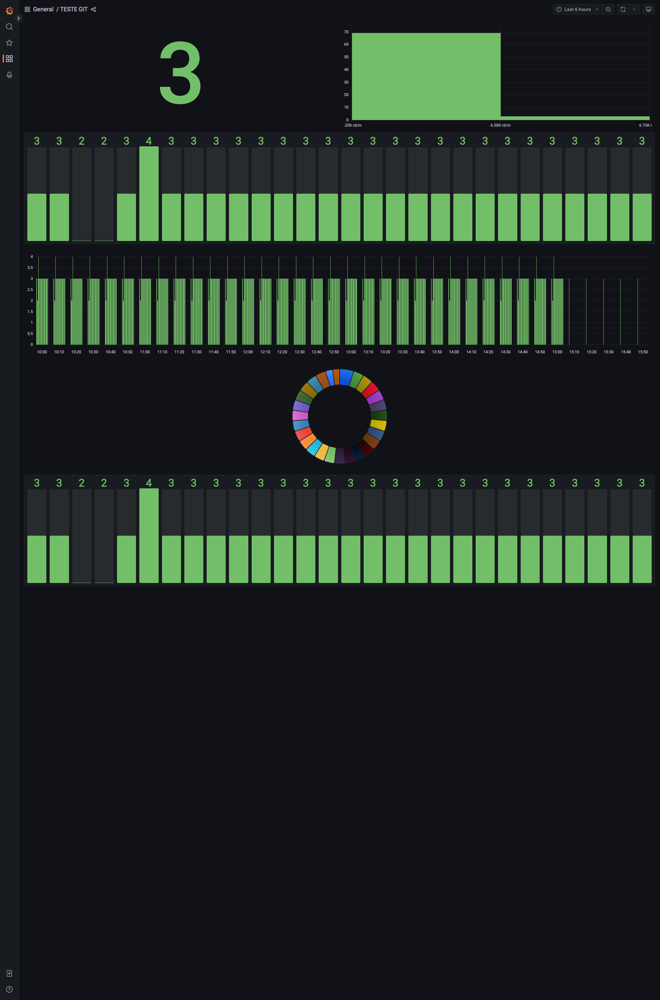
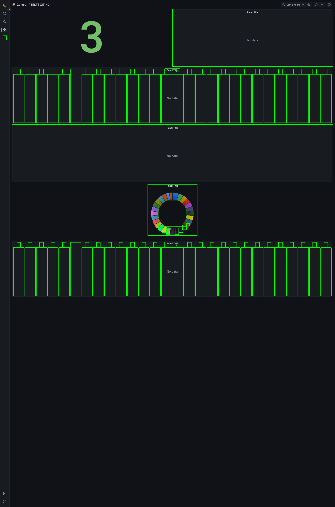

# playwright-compare-images

O script nesse repositório tem como objetivo comparar imagens extraidas de dois endpoints e calcular o grau de diferença entre elas

Ele recebe um arquivo no formato .csv com o seguinte formato: NOME,URL STAGING,URL PROD,DIFERENCA

Abaixo temos um exemplo de como o código analiza as imagens:

IMAGE 1           |  IMAGE 2 | RESULT
:-------------------------:|:-------------------------:|:-------------------------:
  |    | 

